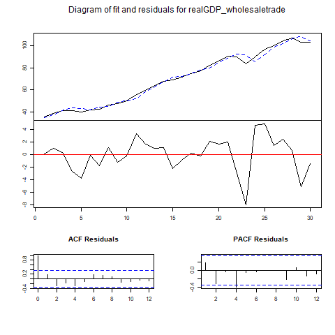
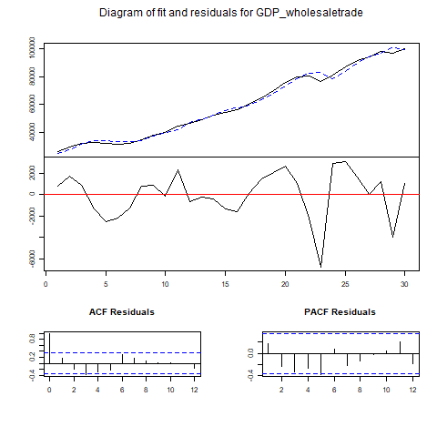

```{r setup, include=FALSE}
knitr::opts_chunk$set(echo = FALSE,warning = FALSE, message = FALSE)
library(cansim)
library(tidyverse)
library(vars)
library(Metrics)
library(astsa)
```

```{r dataimport}

realGDP_wholesaletrade <- get_cansim_vector("v41712938", start_time = "1986-01-01", end_time = "2016-12-01") %>%
pull(VALUE) %>% ts( start = c(1986,1), frequency = 1)

GDP_wholesaletrade <- get_cansim_vector("v41713159", start_time = "1986-01-01", end_time = "2016-12-01") %>%
pull(VALUE) %>% ts( start = c(1986,1), frequency = 1)


```

# 1.

```{r}
plot(GDP_wholesaletrade)
```

```{r}
adfresult<-tseries::adf.test(GDP_wholesaletrade)
print(adfresult)
```


From the time series plot, though no apparent seasonality can be detected, clearly there is a increasing trend in our data. In addition, refer to the adf test result, the null hypothesis, which implies the data is not stationary, is not rejected since the p-value is far beyond significance. Therefore, the data is not stationary.

# 2.

```{r}
y=cbind(realGDP_wholesaletrade,GDP_wholesaletrade)
var1 <- VAR(na.omit(y),p=1)
var1
m <- matrix(c(1.1691320058,-0.0001792849,226.8336350,0.7881462),nrow=2,byrow=TRUE)
eigen(m)

```

# 3.

```{r}
#var1 %>% plot()
var1 %>% resid() %>% acf()
residual <- var1 %>% resid()
print(paste('MAPE for nominal GDP is', mean(abs(residual[,2]/na.omit(y[2:31,2])))))
#MAPE(a)
```






# 4.

```{r}
forecast::auto.arima(GDP_wholesaletrade, xreg=realGDP_wholesaletrade,d=1)
sarima(GDP_wholesaletrade,0,1,0,xreg=realGDP_wholesaletrade)
```

# 5.

```{r}
Capital_productivity <- get_cansim_vector("v41712921", start_time = "1986-01-01", end_time = "2016-12-01") %>%
pull(VALUE) %>% ts( start = c(1986,1), frequency = 1)

Combined_labour_and_capital_inputs <- get_cansim_vector("v41713142", start_time = "1986-01-01", end_time = "2016-12-01") %>%
pull(VALUE) %>% ts( start = c(1986,1), frequency = 1)

forecast::auto.arima(GDP_wholesaletrade, xreg=Combined_labour_and_capital_inputs,d=1)
sarima(GDP_wholesaletrade,0,1,0,xreg=Combined_labour_and_capital_inputs)
```

# Appendix

```{r ref.label=knitr::all_labels(), echo=TRUE, eval=FALSE}
```